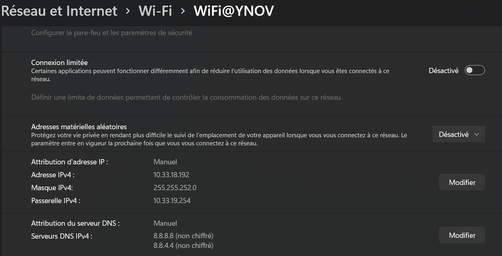
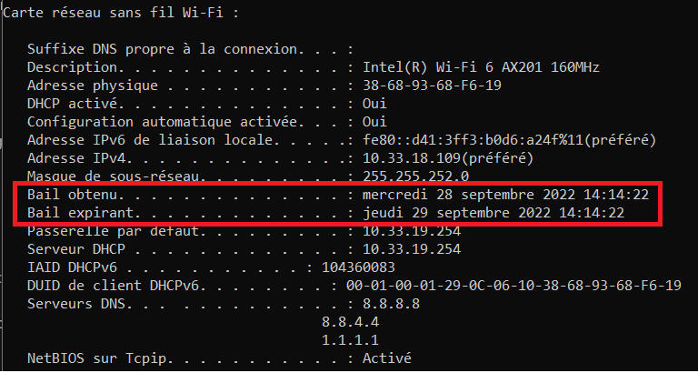
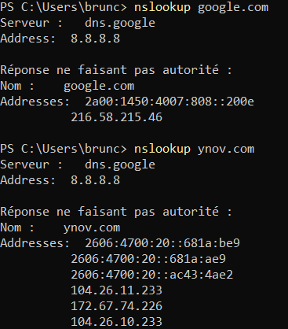
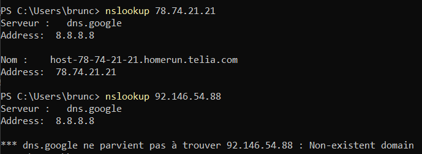
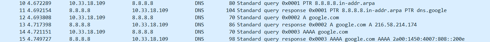

# B2 Réseau 2022 - TP1

# TP1 - Mise en jambes

**Dans ce TP, on va explorer le réseau de vos clients, vos PC.**

Le terme *réseau* désigne au sens large toutes les fonctionnalités d'un PC permettant de se connecter à d'autres machines.  

De façon simplifiée, on appelle *stack TCP/IP* ou *pile TCP/IP* l'ensemble de logiciels qui permettent d'utiliser et configurer des [cartes réseau](../../cours/lexique.md#carte-r%C3%A9seau-ou-interface-r%C3%A9seau) avec des adresses IP.

C'est juste un gros mot savant pour désigner tout ce qui touche de près ou de loin au réseau dans une machine okay ? :)

Lorsque l'on parle de réseau, on désigne souvent par *client* tout équipement qui porte une adresse IP.

Donc vos PCs sont des *clients*, et on va explorer leur *réseau*, c'est à dire, leur *pile TCP/IP*.

# Sommaire
- [B2 Réseau 2022 - TP1](#b2-réseau-2022---tp1)
- [TP1 - Mise en jambes](#tp1---mise-en-jambes)
- [Sommaire](#sommaire)
- [Déroulement et rendu du TP](#déroulement-et-rendu-du-tp)
- [I. Exploration locale en solo](#i-exploration-locale-en-solo)
  - [1. Affichage d'informations sur la pile TCP/IP locale](#1-affichage-dinformations-sur-la-pile-tcpip-locale)
    - [En ligne de commande](#en-ligne-de-commande)
    - [En graphique (GUI : Graphical User Interface)](#en-graphique-gui--graphical-user-interface)
    - [Questions](#questions)
  - [2. Modifications des informations](#2-modifications-des-informations)
    - [A. Modification d'adresse IP (part 1)](#a-modification-dadresse-ip-part-1)
- [II. Exploration locale en duo](#ii-exploration-locale-en-duo)
  - [1. Prérequis](#1-prérequis)
  - [2. Câblage](#2-câblage)
  - [Création du réseau (oupa)](#création-du-réseau-oupa)
  - [3. Modification d'adresse IP](#3-modification-dadresse-ip)
  - [4. Utilisation d'un des deux comme gateway](#4-utilisation-dun-des-deux-comme-gateway)
  - [5. Petit chat privé](#5-petit-chat-privé)
  - [6. Firewall](#6-firewall)
- [III. Manipulations d'autres outils/protocoles côté client](#iii-manipulations-dautres-outilsprotocoles-côté-client)
  - [1. DHCP](#1-dhcp)
  - [2. DNS](#2-dns)
- [IV. Wireshark](#iv-wireshark)
- [Bilan](#bilan)

# Déroulement et rendu du TP

- Groupe de 2 jusqu'à 4 personnes. Il faut au moins deux PCs avec une prise RJ45 (Ethernet) par groupe
- Un câble RJ45 (fourni) pour connecter les deux PCs
- **Un compte-rendu par personne**
  - vu que vous travaillez en groupe, aucun problème pour copier/coller les parties à faire à plusieurs (tout le [`II.`](#ii-exploration-locale-en-duo))
  - une bonne partie est à faire de façon individuelle malgré tout (tout le [`I.`](#i-exploration-locale-en-solo) et le [`III.`](#iii-manipulations-dautres-outilsprotocoles-côté-client))
  - on prendra le temps, mais le travail devra être rendu à travers Github ou tout autre plateforme supportant le `md` (markdown)
- Le rendu doit :
  - comporter des réponses aux questions explicites
  - comporter la marche à suivre pour réaliser les étapes demandées :
    - en ligne de commande, copier/coller des commandes et leurs résultat
    - en interface graphique, screenshots ou nom des menus où cliquer (sinon ça peut vite faire 1000 screenshots)
  - par exemple, pour la partie `1.A.` je veux le la commande tapée et le résultat
    - un copier/coller ça me va très bien, mieux qu'un screen pour de la ligne de commande
  - de façon générale, tout ce que vous faites et qui fait partie du TP, vous me le mettez :)

**⚠️ ⚠️ Désactivez votre firewall pour ce TP. ⚠️ ⚠️**

# I. Exploration locale en solo

## 1. Affichage d'informations sur la pile TCP/IP locale

### En ligne de commande

En utilisant la ligne de commande (CLI) de votre OS :

**🌞 Affichez les infos des cartes réseau de votre PC**

```
ipconfig /all
```

- nom, [adresse MAC](../../cours/lexique.md#mac-media-access-control) et adresse IP de l'interface WiFi

```
Intel(R) Wi-Fi 6 AX201 160MHz, 38-68-93-68-F6-19, 10.33.18.109
```

- nom, [adresse MAC](../../cours/lexique.md#mac-media-access-control) et adresse IP de l'interface Ethernet

```
none
```

**🌞 Affichez votre gateway**

- utilisez une commande pour connaître l'adresse IP de la [passerelle](../../cours/lexique.md#passerelle-ou-gateway) de votre carte WiFi

```
route print -4
10.33.19.254
```

### En graphique (GUI : Graphical User Interface)

En utilisant l'interface graphique de votre OS :  

**🌞 Trouvez comment afficher les informations sur une carte IP (change selon l'OS)**


- trouvez l'IP, la MAC et la [gateway](../../cours/lexique.md#passerelle-ou-gateway) pour l'interface WiFi de votre PC

### Questions

- 🌞 à quoi sert la [gateway](../../cours/lexique.md#passerelle-ou-gateway) dans le réseau d'YNOV ?

```
Accéder à d'autres réseaux (serveur DNS par exemple)
```

## 2. Modifications des informations

### A. Modification d'adresse IP (part 1)  

🌞 Utilisez l'interface graphique de votre OS pour **changer d'adresse IP** :

- changez l'adresse IP de votre carte WiFi pour une autre
- ne changez que le dernier octet
  - par exemple pour `10.33.1.10`, ne changez que le `10`
  - valeur entre 1 et 254 compris



🌞 **Il est possible que vous perdiez l'accès internet.** Que ce soit le cas ou non, expliquez pourquoi c'est possible de perdre son accès internet en faisant cette opération.

```
On peut perdre son accès si l'adresse IP est invalide (hors plage attribuée aux utilisateurs), ou qu'elle correspond à celle utilisée par un autre utilisateur
```

---

- **NOTE :** si vous utilisez la même IP que quelqu'un d'autre, il se passerait la même chose qu'en vrai avec des adresses postales :
  - deux personnes habitent au même numéro dans la même rue, mais dans deux maisons différentes
  - quand une de ces personnes envoie un message, aucun problème, l'adresse du destinataire est unique, la lettre sera reçue
  - par contre, pour envoyer un message à l'une de ces deux personnes, le facteur sera dans l'impossibilité de savoir dans quelle boîte aux lettres il doit poser le message
  - ça marche à l'aller, mais pas au retour

# II. Exploration locale en duo

```
PAS DE RJ45 : Partie explorée avec Mehdi SENHAJ et Matthias BATGUZERRE, voir compte-rendu de leur TP
```

  
# III. Manipulations d'autres outils/protocoles côté client

## 1. DHCP

Bon ok vous savez définir des IPs à la main. Mais pour être dans le réseau YNOV, vous l'avez jamais fait.  

C'est le **serveur DHCP** d'YNOV qui vous a donné une IP.

Une fois que le serveur DHCP vous a donné une IP, vous enregistrer un fichier appelé *bail DHCP* qui contient, entre autres :

- l'IP qu'on vous a donné
- le réseau dans lequel cette IP est valable

🌞Exploration du DHCP, depuis votre PC

- afficher l'adresse IP du serveur DHCP du réseau WiFi YNOV

```
ipconfig /all

Serveur DHCP . . . . . . . . . . . . . : 10.33.19.254
```

- cette adresse a une durée de vie limitée. C'est le principe du ***bail DHCP*** (ou *DHCP lease*). Trouver la date d'expiration de votre bail DHCP



- vous pouvez vous renseigner un peu sur le fonctionnement de DHCP dans les grandes lignes. On aura sûrement un cours là dessus :)

## 2. DNS

Le protocole DNS permet la résolution de noms de domaine vers des adresses IP. Ce protocole permet d'aller sur `google.com` plutôt que de devoir connaître et utiliser l'adresse IP du serveur de Google.  

Un **serveur DNS** est un serveur à qui l'on peut poser des questions (= effectuer des requêtes) sur un nom de domaine comme `google.com`, afin d'obtenir les adresses IP liées au nom de domaine.  

Si votre navigateur fonctionne "normalement" (il vous permet d'aller sur `google.com` par exemple) alors votre ordinateur connaît forcément l'adresse d'un serveur DNS. Et quand vous naviguez sur internet, il effectue toutes les requêtes DNS à votre place, de façon automatique.

- 🌞 trouver l'adresse IP du serveur DNS que connaît votre ordinateur

```
ipconfig /all

   Serveurs DNS. . .  . . . . . . . . . . : 8.8.8.8
                                       8.8.4.4
                                       1.1.1.1
```

- 🌞 utiliser, en ligne de commande l'outil `nslookup` (Windows, MacOS) ou `dig` (GNU/Linux, MacOS) pour faire des requêtes DNS à la main

  - faites un *lookup* (*lookup* = "dis moi à quelle IP se trouve tel nom de domaine")
    - pour `google.com`
    - pour `ynov.com`
    - interpréter les résultats de ces commandes

  

  ```
  les réponses sont fournies par le serveur DNS de google
  google.com renvoie à deux adresses (1 IPv4, 1 IPv6)
  ynov.com renvoie à six adresses (3 IPv6, 3 IPv6)
  ```

  - déterminer l'adresse IP du serveur à qui vous venez d'effectuer ces requêtes

```
c'est l'adresse du serveur DNS de Google : 8.8.8.8
```

  - faites un *reverse lookup* (= "dis moi si tu connais un nom de domaine pour telle IP")
    - pour l'adresse `78.74.21.21`
    - pour l'adresse `92.146.54.88`
    - interpréter les résultats



```
la première adresse est celle d'un serveur hebergeant "homerun.telia.com"
la deuxième ne renvoie à aucun domaine existant
```

    - *si vous vous demandez, j'ai pris des adresses random :)*

# IV. Wireshark

Wireshark est un outil qui permet de visualiser toutes les trames qui sortent et entrent d'une carte réseau.

Il peut :

- enregistrer le trafic réseau, pour l'analyser plus tard
- afficher le trafic réseau en temps réel

**On peut TOUT voir.**

Un peu austère aux premiers abords, une manipulation très basique permet d'avoir une très bonne compréhension de ce qu'il se passe réellement.

- téléchargez l'outil [Wireshark](https://www.wireshark.org/)
- 🌞 utilisez le pour observer les trames qui circulent entre vos deux carte Ethernet. Mettez en évidence :
  - un `ping` entre vous et la passerelle

  

  - un `netcat` entre vous et votre mate, branché en RJ45

```
pas de RJ45
```

  - une requête DNS. Identifiez dans la capture le serveur DNS à qui vous posez la question.



  - prenez moi des screens des trames en question
  - on va prendre l'habitude d'utiliser Wireshark souvent dans les cours, pour visualiser ce qu'il se passe

# Bilan

**Vu pendant le TP :**

- visualisation de vos interfaces réseau (en GUI et en CLI)
- extraction des informations IP
  - adresse IP et masque
  - calcul autour de IP : adresse de réseau, etc.
- connaissances autour de/aperçu de :
  - un outil de diagnostic simple : `ping`
  - un outil de scan réseau : `nmap`
  - un outil qui permet d'établir des connexions "simples" (on y reviendra) : `netcat`
  - un outil pour faire des requêtes DNS : `nslookup` ou `dig`
  - un outil d'analyse de trafic : `wireshark`
- manipulation simple de vos firewalls

**Conclusion :**

- Pour permettre à un ordinateur d'être connecté en réseau, il lui faut **une liaison physique** (par câble ou par *WiFi*).  
- Pour réceptionner ce lien physique, l'ordinateur a besoin d'**une carte réseau**. La carte réseau porte une [adresse MAC](../../cours/lexique.md#mac-media-access-control).  
- **Pour être membre d'un réseau particulier, une carte réseau peut porter une adresse IP.**
Si deux ordinateurs reliés physiquement possèdent une adresse IP dans le même réseau, alors ils peuvent communiquer.  
- **Un ordintateur qui possède plusieurs cartes réseau** peut réceptionner du trafic sur l'une d'entre elles, et le balancer sur l'autre, servant ainsi de "pivot". Cet ordinateur **est appelé routeur**.
- Il existe dans la plupart des réseaux, certains équipements ayant un rôle particulier :
  - un équipement appelé **[*passerelle*](../../cours/lexique.md#passerelle-ou-gateway)**. C'est un routeur, et il nous permet de sortir du réseau actuel, pour en joindre un autre, comme Internet par exemple
  - un équipement qui agit comme **serveur DNS** : il nous permet de connaître les IP derrière des noms de domaine
  - un équipement qui agit comme **serveur DHCP** : il donne automatiquement des IP aux clients qui rejoigne le réseau
  - **chez vous, c'est votre Box qui fait les trois :)**

🌞 Ce soleil est un troll. **Lisez et prenez le temps d'appréhender le texte de conclusion juste au dessus si ces notions ne vous sont pas familières.**
